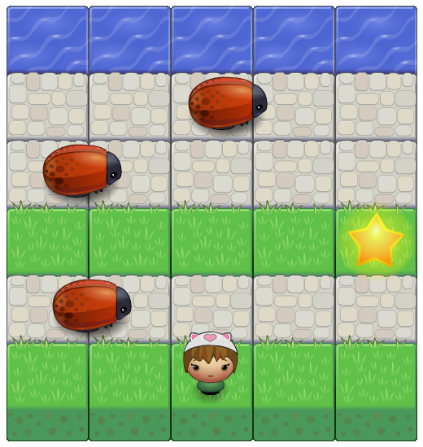

## Welcome to Starchaser!

This is my Frogger clone for the Udacity Front-End Web Development nanodegree.

The player must reach the water without colliding with any bugs. Why Starchaser? Because the player can collect gold stars, which will appear at random on the board. You can play the game on [my GitHub page](http://tiny.cc/starchaser/ "Starchaser arcade game clone") :)

### How to play?

- Use the arrow keys to move your player up, down, left and right. She will be safe on the grassy areas.
- Whenever she reaches the water, she will be transported back to the grass on the other side of the board.
- She starts with 3 extra lives and loses a life whenever she runs into a bug.
- When she has no lives remaining, she can get an extra life whenever your score is divisible by 15.

### What’s the score?

- Get 10 points every time the player reaches the water.
- Get 5 points per star. Collect a star by moving to where it is.
- Whenever your player gets an extra life, you get 5 bonus points.

### Credits

Having absolutely zero programming background, I needed step-by-step explanations for _every single line_ of code. Some were provided in a discussion post written by Udacity coach Udayan. However, I still had to copy from students who shared their work in the forum. Many thanks to danielmoi, morapost, andrewlw89, jyothisridhar, ayimaster, lacyjpr, joseterrera, poonamgp14, justintemps and dooster, among others. Thanks also to my code reviewers.

### License

Starchaser is licensed under [GitHub’s terms of service](https://help.github.com/articles/github-terms-of-service/), meaning you can view and fork this repository.
